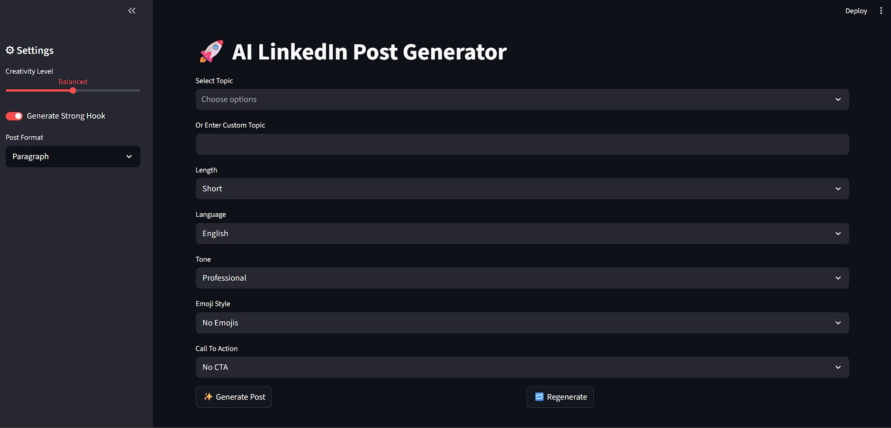
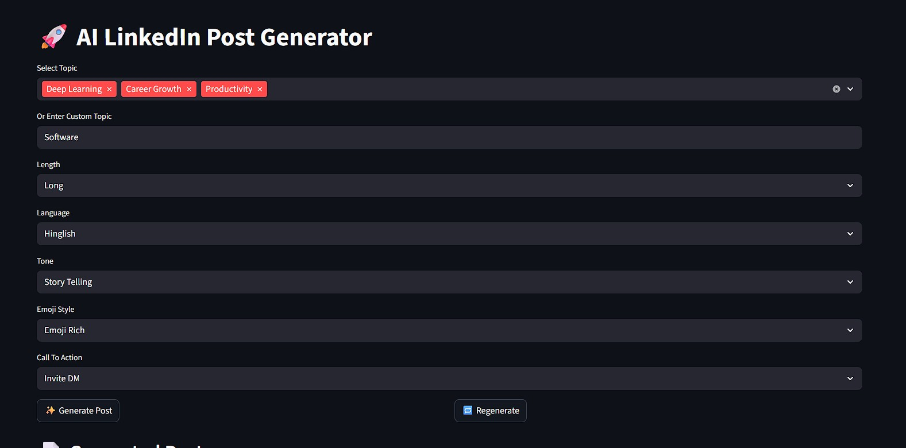
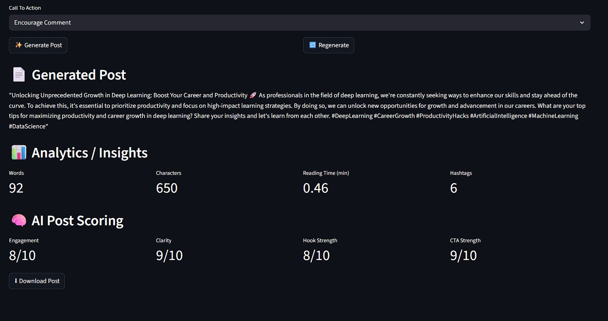
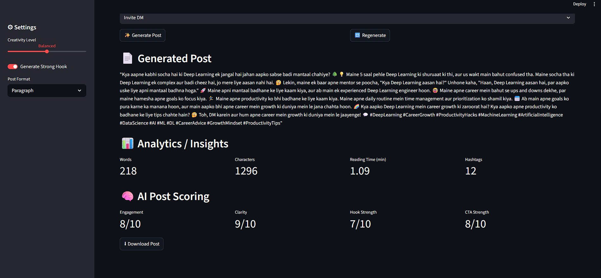

# 🚀 AI LinkedIn Post Generator


------------------------------------------------------------------------

## 📌 Overview

**AI LinkedIn Post Generator** is a Retrieval-Augmented Generation
(RAG)-based application built using **LangChain** and **Ollama (Offline
LLM)** with a fully interactive **Streamlit UI**.

The system enables users to generate high-quality, professional LinkedIn
posts with structured customization and AI-driven evaluation. It
demonstrates advanced prompt engineering, multi-stage LLM pipelines,
structured output parsing, and analytics integration.

------------------------------------------------------------------------

## 📑 Table of Contents

-   [Key Features](#-key-features)
-   [System Architecture](#-system-architecture)
-   [Project Structure](#-project-structure)
-   [Installation](#-installation)
-   [Usage](#-usage)
-   [Configuration](#-configuration)
-   [Analytics & AI Scoring](#-analytics--ai-scoring)
-   [Future Enhancements](#-future-enhancements)
-   [Author](#-author)

------------------------------------------------------------------------

## ✨ Key Features

### 🎯 Content Customization

-   Topic dropdown with custom topic input
-   Length control (Short / Medium / Long)
-   Tone selection
-   Emoji inclusion toggle
-   Call-to-action (CTA) selection
-   Format selection (Paragraph / Bullet Points)
-   Strong hook generation toggle

### 🎛 Creativity Control

Creativity levels mapped to model temperature:

-   **Low** -- Structured & deterministic output
-   **Balanced** -- Moderately creative
-   **High** -- Highly creative & diverse

### 🔁 Regeneration Capability

Generate alternative versions using identical input parameters for
A/B-style content exploration.

------------------------------------------------------------------------

## 📸 Demo Screenshots

### User Interface


### Input Customization 


### Responses




## 🏗 System Architecture

    User Input
        ↓
    Streamlit UI
        ↓
    Prompt Builder
        ↓
    Ollama LLM (Offline)
        ↓
    Post Processor
        ↓
    Analytics Engine
        ↓
    AI Evaluation Module
        ↓
    Final Output

### Architectural Highlights

-   Structured Prompt Engineering
-   Controlled LLM Generation
-   Two-Stage LLM Pipeline (Generation + Evaluation)
-   JSON Output Parsing
-   Regex-Based Post Processing
-   Modular Design

------------------------------------------------------------------------

## 📂 Project Structure

    POST_GENERATION/
    │
    ├── data/
    │   └── processed_posts.json
    ├── demo/ images 
    ├── few_shot.py
    ├── llm_helper.py
    ├── main.py
    ├── post_generator.py
    ├── preprocess.py
    ├── .env  (Add your GROQ_API_KEY)
    └── README.md

### 📄 File Descriptions

  ------------------------------------------------------------------------------
  File                          Description
  ----------------------------- ------------------------------------------------
  `main.py`                     Streamlit UI and application workflow

  `post_generator.py`           Prompt construction, generation, analytics &
                                scoring

  `llm_helper.py`               LLM configuration (Ollama / Groq integration)

  `few_shot.py`                 Few-shot example filtering and tag management

  `preprocess.py`               Metadata extraction and dataset preparation
  
  `data/processed_posts.json`   Structured few-shot training examples
  
  ------------------------------------------------------------------------------

------------------------------------------------------------------------

## ⚙ Installation

### 1️⃣ Clone the Repository

``` bash
git clone https://github.com/Shreya140724/LLM-Based-LinkedIn-Post-Generator-Evaluation-System.git
cd POST_GENERATION
```

### 2️⃣ Create Virtual Environment

Using Conda:

``` bash
conda create -n postgen python=3.10
conda activate postgen
```

### 3️⃣ Install Dependencies

``` bash
pip install -r requirements.txt
```

### 4️⃣ Run the Application

``` bash
streamlit run main.py
```

------------------------------------------------------------------------

## ▶ Usage

1.  Select or enter a topic.
2.  Configure tone, length, and creativity level.
3.  Toggle hook, emojis, formatting style, and CTA.
4.  Generate the LinkedIn post.
5.  Review analytics and AI-based scoring.
6.  Regenerate alternative versions if required.

------------------------------------------------------------------------

## 🔧 Configuration

-   Add your `GROQ_API_KEY` inside the `.env` file (if using Groq).
-   Modify temperature mappings in `post_generator.py`.
-   Update `processed_posts.json` to refine few-shot examples.
-   Adjust prompt templates inside `post_generator.py` for
    customization.

------------------------------------------------------------------------

## 📊 Analytics & AI Scoring

After content generation, the system performs:

### 📈 Text Analytics

-   Word count
-   Character count
-   Estimated reading time
-   Hashtag detection

### 🧠 AI Evaluation Metrics

A second-stage LLM evaluates the post and returns structured JSON scores
for:

-   Engagement
-   Clarity
-   Hook Strength
-   CTA Strength

This ensures content is optimized for both readability and audience
engagement.

------------------------------------------------------------------------

## 🚀 Future Enhancements

-   A/B post generation comparison
-   Trending hashtag extraction via API
-   Deployment on Streamlit Cloud
-   User post history logging
-   Advanced sentiment analysis

------------------------------------------------------------------------

## 👩‍💻 Author

**Shreya Sidabache**
AI / ML Engineer
